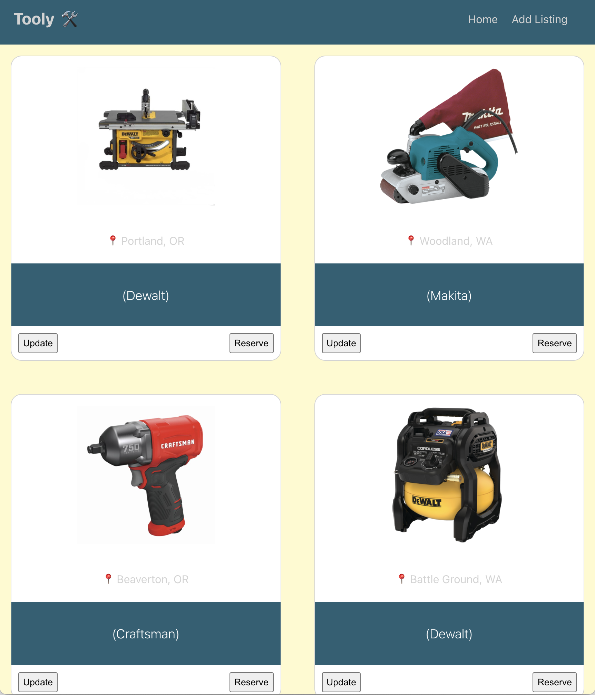

# Tooly API



## Description

The Tooly API is used to store and update data of all the listings used in the Tooly App. This API is necessary to keep all Tooly App users with up to date information about the tools listed on the website. 

## Features

- Full CRUD capabilities of each tool listing in the API.

## Technologies Used
- bcrypt
- cors
- dotenv
- express
- jsonwebtoken
- mongoose
- mongoDB
- nodemon
- passport

## Getting Started
- Fork and clone this repository
- Using your terminal, 'cd' into your local copy of this repository and install all necessary dependencies using the below command 

```
npm install
```

- Open code in code editor of your choice.
- Code is preconfigured to port 8000 for access to data.
```
ex. http://localhost:8000/
```

## Contributions
- Source code: [https://github.com/Squirtle-Squad-1150/tooly-backend](https://github.com/Squirtle-Squad-1150/tooly-backend)
- Issue Tracker: [https://github.com/Squirtle-Squad-1150/tooly-backend/issues](https://github.com/Squirtle-Squad-1150/tooly-backend/issues)